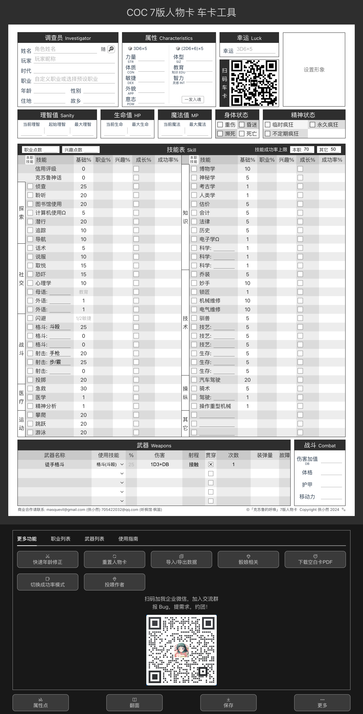

# TRPG 赛高！

一个 TRPG 辅助工具。自己有什么需求都会一点一点加进来。

- [TRPG 赛高！](#trpg-赛高)
  - [包含工具](#包含工具)
    - [车卡工具](#车卡工具)
    - [KP 招募 PL 展示器](#kp-招募-pl-展示器)
    - [记录工具](#记录工具)
  - [Project Setup](#project-setup)
  - [商业使用](#商业使用)

## 包含工具

### 车卡工具

[https://masquevil.github.io/trpg-saikou/#/coc-card](https://masquevil.github.io/trpg-saikou/#/coc-card)



1. 生成正反面图片，方便打印
2. 可以打印空白卡线下车卡
3. 也可以在线车卡
4. 内置 1000+ 张 AI 生成的头像，方便快速车一张精品卡
5. 主要设计参考：听枫馆北京TRPG跑团桌游吧。

### KP 招募 PL 展示器


1. 展示某个【KP】、【俱乐部】或【店铺】当前可以带的模组、准备中的模组
2. 方便截图发布招募贴，寻找 PL
3. 目前只支持展示我自己
4. （孩子不想搞服务器啊！后端不算特别熟，加上之前被人攻击了一波，感觉维护成本太高了，纯前端项目就没那么容易搞多人的）
5. （接下来应该会用 github gist 支持一定程度上的数据库，但是需要各位会用 github 才能加入自己的数据）

### 记录工具


1. 需拉取本仓库代码后本地使用
2. 记录自己 TRPG 打卡记录、评价、想玩程度
3. 方便截图分享寻找队友拼车

## Project Setup

```sh
yarn install

sh ./shell/copy.sh

yarn dev
```

## 商业使用

交流、反馈、新需求请：[提 Issue](https://github.com/masquevil/trpg-saikou/issues)

如需商业合作，可以联系：

* 侠小然(masquevil@gmail.com)
* 听枫馆(北京) · 枫笛 (微信：drivehe)
